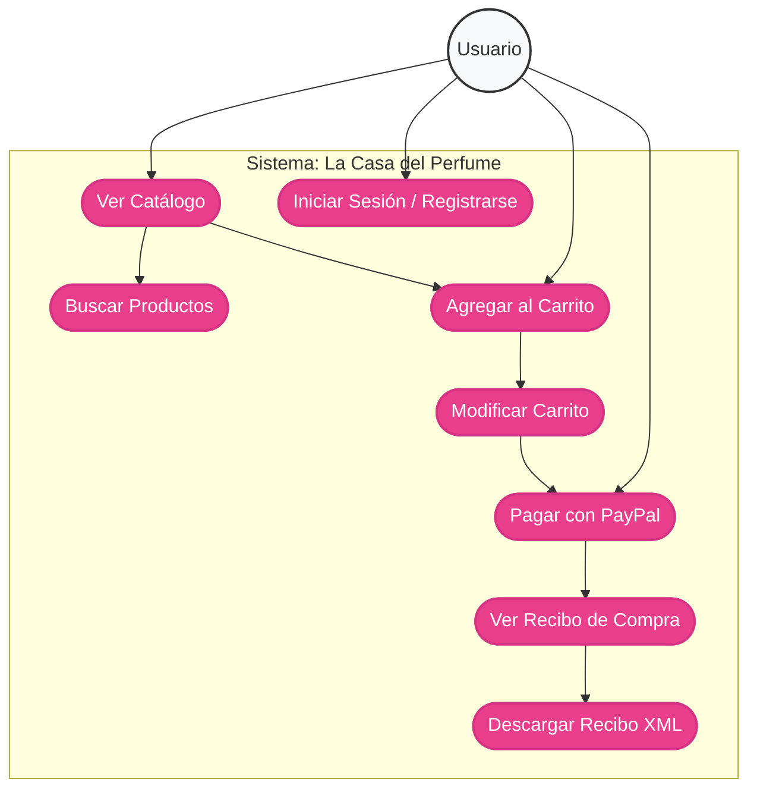
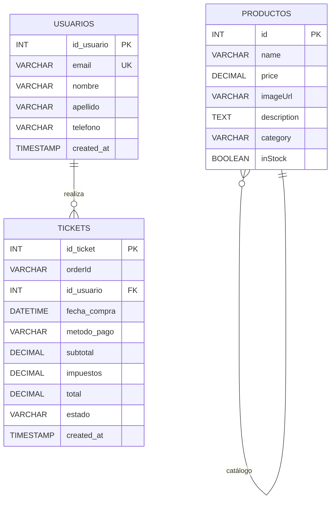
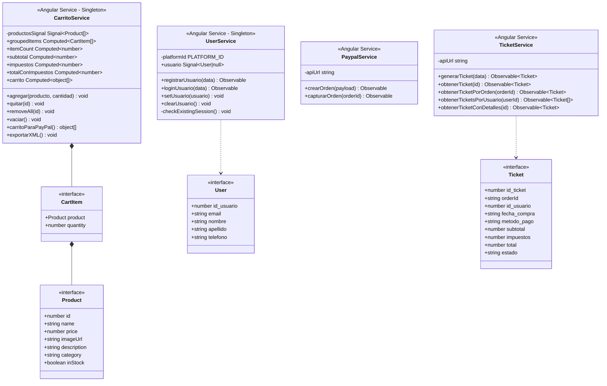
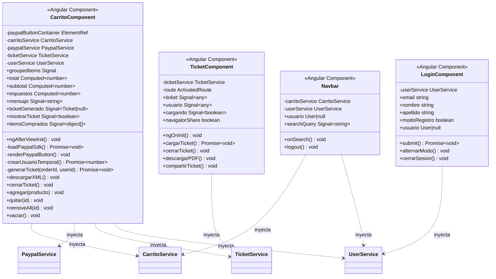
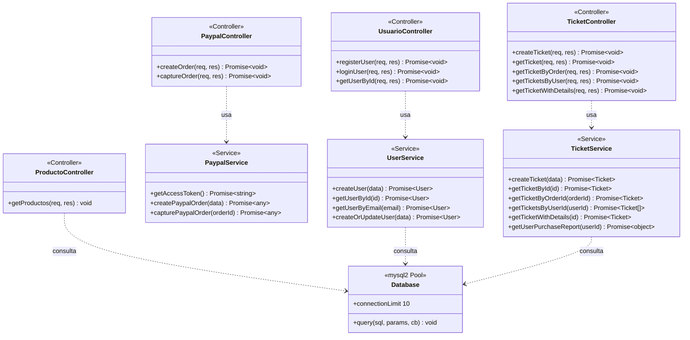
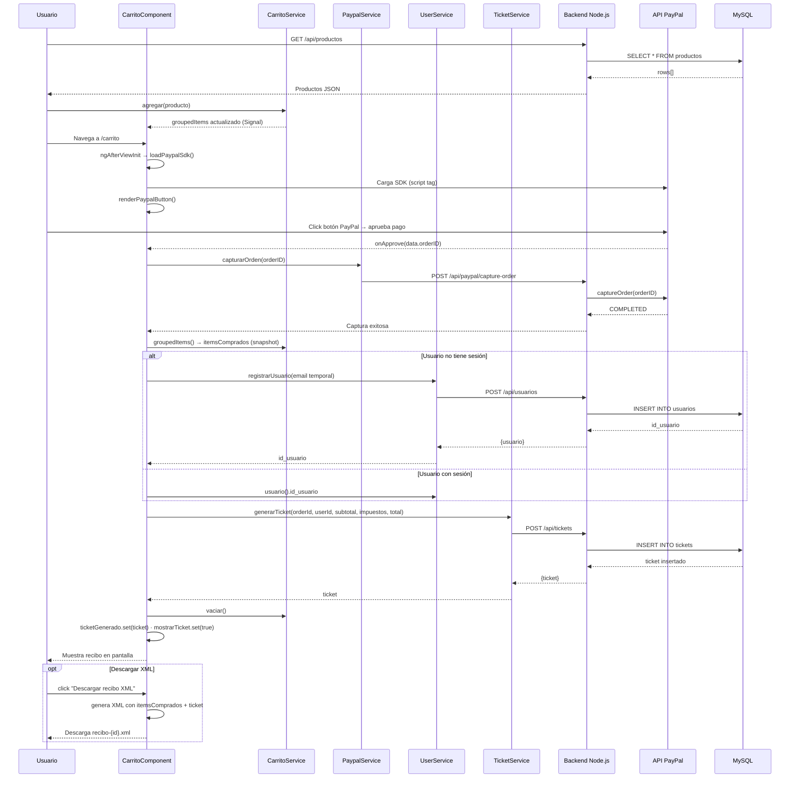
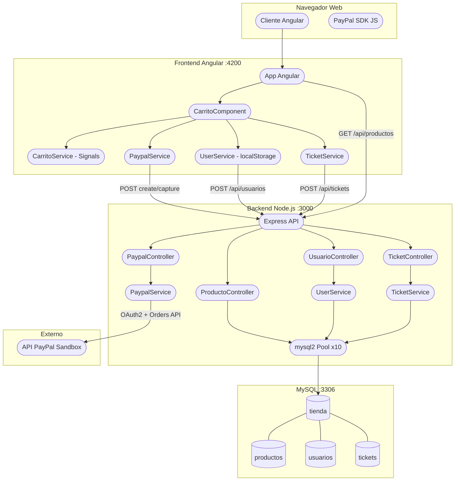

# Diagramas UML - La Casa del Perfume

## Descripción del Proyecto
E-commerce especializado en la venta de perfumes, construido con Angular en el frontend y Node.js/Express con MySQL en el backend. Integración de pagos mediante PayPal con generación de tickets y exportación de recibos en XML.

---

## 1. Diagrama de Casos de Uso



### Descripción de Casos de Uso:

| Caso de Uso | Descripción | Flujo Principal |
|-------------|-------------|-----------------|
| **Ver Catálogo** | Navegar por los productos disponibles | Usuario ingresa → sistema muestra productos desde BD |
| **Buscar Productos** | Filtrar productos por nombre | Ingresa texto → sistema filtra en tiempo real |
| **Agregar al Carrito** | Añadir productos al carrito | Selecciona producto → carrito se actualiza vía Signal |
| **Modificar Carrito** | Cambiar cantidad o quitar productos | Selecciona acción → servicio actualiza estado reactivo |
| **Iniciar Sesión / Registrarse** | Autenticarse o crear cuenta | Ingresa email → backend valida/crea usuario en BD |
| **Pagar con PayPal** | Completar compra desde el carrito | Aprueba en PayPal → backend captura → guarda ticket en BD |
| **Ver Recibo de Compra** | Consultar ticket generado en pantalla | Pago aprobado → sistema muestra ticket con totales |
| **Descargar Recibo XML** | Exportar compra como archivo XML | Solicita descarga → sistema genera XML con productos y totales |

---

## 2. Diagrama Entidad-Relación (ER)



### Tablas en la Base de Datos:

#### **USUARIOS**
| Campo | Tipo | Descripción |
|-------|------|-------------|
| `id_usuario` | INT PK AUTO_INCREMENT | Identificador único |
| `email` | VARCHAR(255) UNIQUE | Correo electrónico |
| `nombre` | VARCHAR(100) | Nombre(s) |
| `apellido` | VARCHAR(100) | Apellidos |
| `telefono` | VARCHAR(20) | Teléfono (opcional) |
| `created_at` | TIMESTAMP | Fecha de registro |

#### **PRODUCTOS**
| Campo | Tipo | Descripción |
|-------|------|-------------|
| `id` | INT PK | Identificador único |
| `name` | VARCHAR(255) | Nombre del perfume |
| `price` | DECIMAL(10,2) | Precio unitario |
| `imageUrl` | VARCHAR(500) | URL de imagen |
| `description` | TEXT | Descripción detallada |
| `category` | VARCHAR(100) | Categoría/Familia olfativa |
| `inStock` | BOOLEAN | Disponibilidad |

#### **TICKETS**
| Campo | Tipo | Descripción |
|-------|------|-------------|
| `id_ticket` | INT PK AUTO_INCREMENT | Identificador único |
| `orderId` | VARCHAR(50) | ID de orden PayPal |
| `id_usuario` | INT FK → usuarios | Usuario comprador |
| `fecha_compra` | DATETIME | Fecha y hora de compra |
| `metodo_pago` | VARCHAR(50) | Siempre `'PayPal'` |
| `subtotal` | DECIMAL(10,2) | Subtotal sin IVA |
| `impuestos` | DECIMAL(10,2) | IVA 16% |
| `total` | DECIMAL(10,2) | Total final |
| `estado` | VARCHAR(20) | `APROBADO` / `PENDIENTE` / `CANCELADO` |
| `created_at` | TIMESTAMP | Fecha de registro |

> **Nota:** No existen tablas `transacciones` ni `items_transaccion`. El carrito se gestiona en memoria (Angular Signals) y los items no se persisten en BD. Solo se guarda el resumen financiero en `tickets`.

---

## 3. Diagrama de Clases — Servicios y Modelos Frontend



---

## 4. Diagrama de Clases — Componentes Frontend



---

## 5. Diagrama de Clases — Backend



### Rutas del API REST:

| Método | Ruta | Controlador | Descripción |
|--------|------|-------------|-------------|
| GET | `/api/productos` | ProductoController | Obtener catálogo |
| POST | `/api/paypal/create-order` | PaypalController | Crear orden PayPal |
| POST | `/api/paypal/capture-order` | PaypalController | Capturar pago |
| POST | `/api/usuarios` | UsuarioController | Registrar usuario |
| POST | `/api/usuarios/login` | UsuarioController | Login por email |
| GET | `/api/usuarios/:id` | UsuarioController | Obtener usuario |
| POST | `/api/tickets` | TicketController | Crear ticket |
| GET | `/api/tickets/:id` | TicketController | Obtener ticket |
| GET | `/api/tickets/order/:orderId` | TicketController | Ticket por orden PayPal |
| GET | `/api/tickets/usuario/:userId` | TicketController | Tickets de un usuario |
| GET | `/api/tickets/detalle/:id` | TicketController | Ticket con datos de usuario |

---

## 6. Diagrama de Secuencia — Flujo Completo de Compra



---

## 7. Diagrama de Despliegue



---

## 8. SQL — Tablas existentes en producción

### Tabla `usuarios`
```sql
CREATE TABLE IF NOT EXISTS usuarios (
    id_usuario INT AUTO_INCREMENT PRIMARY KEY,
    email      VARCHAR(255) NOT NULL UNIQUE,
    nombre     VARCHAR(100) NOT NULL,
    apellido   VARCHAR(100) NOT NULL,
    telefono   VARCHAR(20),
    created_at TIMESTAMP DEFAULT CURRENT_TIMESTAMP,
    INDEX idx_email (email)
) ENGINE=InnoDB DEFAULT CHARSET=utf8mb4;
```

### Tabla `tickets`
```sql
CREATE TABLE IF NOT EXISTS tickets (
    id_ticket    INT AUTO_INCREMENT PRIMARY KEY,
    orderId      VARCHAR(50) NOT NULL,
    id_usuario   INT NOT NULL,
    fecha_compra DATETIME NOT NULL DEFAULT CURRENT_TIMESTAMP,
    metodo_pago  VARCHAR(50) DEFAULT 'PayPal',
    subtotal     DECIMAL(10,2) NOT NULL,
    impuestos    DECIMAL(10,2) NOT NULL,
    total        DECIMAL(10,2) NOT NULL,
    estado       VARCHAR(20) DEFAULT 'APROBADO',
    created_at   TIMESTAMP DEFAULT CURRENT_TIMESTAMP,
    FOREIGN KEY (id_usuario) REFERENCES usuarios(id_usuario) ON DELETE CASCADE,
    INDEX idx_orderId (orderId),
    INDEX idx_usuario (id_usuario),
    INDEX idx_fecha   (fecha_compra)
) ENGINE=InnoDB DEFAULT CHARSET=utf8mb4;
```

### Consultas de ejemplo

```sql
-- Todas las compras de un usuario
SELECT t.id_ticket, t.orderId, t.fecha_compra, t.total, t.estado
FROM tickets t
WHERE t.id_usuario = 1
ORDER BY t.fecha_compra DESC;

-- Reporte de ventas por usuario
SELECT
    u.id_usuario,
    CONCAT(u.nombre, ' ', u.apellido) AS cliente,
    u.email,
    COUNT(t.id_ticket)  AS total_compras,
    SUM(t.total)        AS gasto_total
FROM usuarios u
LEFT JOIN tickets t ON u.id_usuario = t.id_usuario
GROUP BY u.id_usuario
ORDER BY gasto_total DESC;

-- Detalle de un ticket
SELECT
    t.id_ticket,
    t.orderId,
    u.nombre, u.apellido, u.email,
    t.fecha_compra, t.metodo_pago,
    t.subtotal, t.impuestos, t.total, t.estado
FROM tickets t
JOIN usuarios u ON t.id_usuario = u.id_usuario
WHERE t.id_ticket = 1;
```

---

## Notas de Implementación

### Patrones utilizados:
| Patrón | Dónde |
|--------|-------|
| **Singleton** | CarritoService, UserService, TicketService (Angular `providedIn: 'root'`) |
| **Observer / Reactive** | Angular Signals + Computed en CarritoService |
| **Service Layer** | Controllers → Services → DB Pool (backend) |
| **Repository** | UserService y TicketService (Node.js) encapsulan queries |
| **Pool de conexiones** | mysql2 `createPool` con límite de 10 conexiones |

### Decisiones de diseño:
- **Items no se persisten en BD**: el carrito vive en memoria (Signals). Solo el resumen financiero queda en `tickets`.
- **Usuario temporal**: si el cliente no tiene sesión al pagar, se crea un usuario con email `invitado_<timestamp>@temp.com`.
- **SSR guard**: `UserService` usa `isPlatformBrowser` antes de acceder a `localStorage` para compatibilidad con SSR.
- **price como string**: MySQL devuelve `DECIMAL` como string; se aplica `Number()` en todos los cálculos del frontend.
