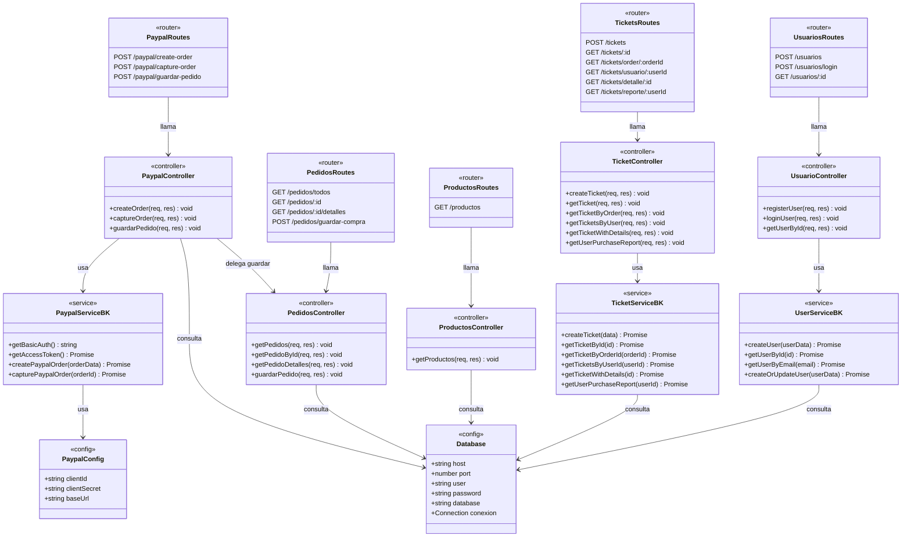

# Diagramas de Clases — La Casa del Perfume

## Frontend (Angular — /src)

```mermaid
classDiagram
direction TB

%% ─── MODELOS ───────────────────────────────────────────────

class Product {
    <<interface>>
    +number id
    +string name
    +number price
    +string imageUrl
    +string description
    +string category
    +boolean inStock
}

class PurchaseItem {
    <<interface>>
    +number producto_id
    +string nombre_producto
    +string categoria
    +number cantidad
    +number precio_unitario
    +number importe
}

class PurchaseOrder {
    <<interface>>
    +number id
    +string folio
    +string fecha
    +string paypal_orden_id
    +string paypal_estado
    +number subtotal
    +number iva
    +number total
    +PurchaseItem[] items
}

class CartItem {
    <<interface>>
    +Product product
    +number quantity
}

class User {
    <<interface>>
    +number id_usuario
    +string email
    +string nombre
    +string apellido
    +string telefono
    +string created_at
}

class Ticket {
    <<interface>>
    +number id_ticket
    +string orderId
    +number id_usuario
    +string fecha_compra
    +string metodo_pago
    +number subtotal
    +number impuestos
    +number total
    +string estado
}

class TicketDetails {
    <<interface>>
    +string nombre
    +string apellido
    +string email
    +string telefono
    +Array productos
}

class PedidoPayload {
    <<interface>>
    +string folio
    +string paypalOrderId
    +string paypalEstado
    +number subtotal
    +number iva
    +number total
    +Array items
}

class ProductAddEvent {
    <<interface>>
    +Product product
    +number quantity
}

%% ─── SERVICIOS ─────────────────────────────────────────────

class ProductsService {
    <<service>>
    -HttpClient http
    -string apiUrl
    +getProducts() Observable
    +getAll() Observable
}

class CarritoService {
    <<service>>
    -Signal productosSignal
    +Computed groupedItems
    +Computed itemCount
    +Computed subtotal
    +Computed impuestos
    +Computed totalConImpuestos
    +agregar(product, cantidad) void
    +quitar(id) void
    +removeAll(id) void
    +vaciar() void
    +descargarReciboXML(folio, paypalOrderId) void
    +exportarXML() void
}

class SearchService {
    <<service>>
    -Signal searchSignal
    -Signal categoryFilterSignal
    +setSearch(query) void
    +setCategoryFilter(category) void
    +clearCategoryFilter() void
}

class PaypalService {
    <<service>>
    -HttpClient http
    -string apiUrl
    +crearOrden(payload) Observable
    +capturarOrden(orderId) Observable
    +guardarPedido(payload) Observable
}

class HistorialComprasService {
    <<service>>
    -HttpClient http
    -string apiUrl
    -Signal comprasSignal
    +Signal loading
    +Signal error
    +obtenerCompras() Promise
    +obtenerCompraPorId(id) Promise
    +guardarCompra(compra) Promise
    +limpiarCompras() void
}

class UserService {
    <<service>>
    -HttpClient http
    -string apiUrl
    +Signal usuario
    +registrarUsuario(data) Observable
    +loginUsuario(data) Observable
    +setUsuario(usuario) void
    +clearUsuario() void
    +getUsuarioActual() User
}

class TicketService {
    <<service>>
    -HttpClient http
    -string apiUrl
    +generarTicket(data) Observable
    +obtenerTicket(id) Observable
    +obtenerTicketPorOrden(orderId) Observable
    +obtenerTicketsPorUsuario(userId) Observable
    +obtenerTicketConDetalles(id) Observable
    +obtenerReporteCompras(userId) Observable
}

%% ─── COMPONENTES ────────────────────────────────────────────

class Home {
    <<component>>
    +Signal showModal
    +Signal modalProductName
    +ngOnInit() void
    +filterByCategory(category) void
    +scrollToCatalog(event) void
}

class Navbar {
    <<component>>
    +Signal searchQuery
    +onSearch() void
    +clearSearch() void
    +goToHistorial() void
}

class Footer {
    <<component>>
    +goHome() void
    +goToCatalog() void
    +goToHistorial() void
}

class Catalogo {
    <<component>>
    +Signal products
    +Signal allProducts
    +Computed filteredProducts
    +Computed categories
    +Computed inStockCount
    +ngOnInit() void
    +agregar(event) void
    +onCategoryChange(category) void
    +clearAllFilters() void
}

class ProductCard {
    <<component>>
    +Product product
    +EventEmitter add
    +Signal quantity
    +incrementQuantity() void
    +decrementQuantity() void
    +onAdd() void
}

class Producto {
    <<component>>
}

class CarritoComponent {
    <<component>>
    +Computed groupedItems
    +Computed subtotal
    +Computed impuestos
    +Computed totalConImpuestos
    +Signal mensaje
    +Signal pagoExitoso
    +Signal folioPago
    +Signal cargandoPaypal
    +ngAfterViewInit() void
    +ngOnDestroy() void
    +agregar(producto) void
    +quitar(id) void
    +removeAll(id) void
    +vaciar() void
    +exportarXML() void
}

class Checkout {
    <<component>>
    +Signal carrito
    +Signal total
    +ngAfterViewInit() void
}

class LoginComponent {
    <<component>>
    +string email
    +string nombre
    +string apellido
    +string telefono
    +boolean modoRegistro
    +string mensaje
    +submit() Promise
    +alternarModo() void
    +cerrarSesion() void
}

class HistorialCompras {
    <<component>>
    +Signal compras
    +Signal loading
    +Signal error
    +ngOnInit() void
    +cargarCompras() void
    +formatearFecha(fecha) string
    +formatearMoneda(valor) string
}

class DetalleCompra {
    <<component>>
    +PurchaseOrder compra
    +Signal loading
    +Signal error
    +ngOnInit() void
    +cargarCompra(id) void
}

class TicketComponent {
    <<component>>
    +Signal ticket
    +Signal usuario
    +Signal cargando
    +Signal error
    +ngOnInit() void
    +descargarPDF() void
    +compartirTicket() void
}

class Contactos {
    <<component>>
    +object formData
    +Signal showSuccess
    +onSubmit(event) void
}

class Privacidad {
    <<component>>
}

%% ─── RELACIONES MODELOS ──────────────────────────────────────
PurchaseOrder o-- PurchaseItem : contiene
TicketDetails --|> Ticket : extiende
CartItem --> Product : referencia

%% ─── RELACIONES SERVICIOS → MODELOS ─────────────────────────
ProductsService ..> Product : retorna
CarritoService ..> Product : usa
CarritoService ..> CartItem : crea
PaypalService ..> PedidoPayload : recibe
HistorialComprasService ..> PurchaseOrder : retorna
UserService ..> User : retorna
TicketService ..> Ticket : retorna
TicketService ..> TicketDetails : retorna

%% ─── RELACIONES COMPONENTES → SERVICIOS ─────────────────────
Catalogo --> ProductsService : inyecta
Catalogo --> CarritoService : inyecta
Catalogo --> SearchService : inyecta
Catalogo --> ProductCard : usa

Home --> SearchService : inyecta
Home --> CarritoService : inyecta

Navbar --> CarritoService : inyecta
Navbar --> SearchService : inyecta

CarritoComponent --> CarritoService : inyecta
CarritoComponent --> PaypalService : inyecta

Checkout --> CarritoService : inyecta
Checkout --> PaypalService : inyecta
Checkout --> HistorialComprasService : inyecta

HistorialCompras --> HistorialComprasService : inyecta
DetalleCompra --> HistorialComprasService : inyecta

LoginComponent --> UserService : inyecta

TicketComponent --> TicketService : inyecta

%% ─── RELACIONES COMPONENTES → MODELOS ───────────────────────
ProductCard ..> Product : recibe
ProductCard ..> ProductAddEvent : emite
HistorialCompras ..> PurchaseOrder : muestra
DetalleCompra ..> PurchaseOrder : muestra
LoginComponent ..> User : usa
TicketComponent ..> TicketDetails : muestra
```

---

## Backend (Node.js/Express — /backend)

```mermaid
classDiagram
direction TB

%% ─── CONFIGURACIÓN ──────────────────────────────────────────

class Database {
    <<config>>
    +string host
    +number port
    +string user
    +string password
    +string database
    +Connection conexion
}

class PaypalConfig {
    <<config>>
    +string clientId
    +string clientSecret
    +string baseUrl
}

%% ─── SERVICIOS ─────────────────────────────────────────────

class PaypalServiceBK {
    <<service>>
    +getBasicAuth() string
    +getAccessToken() Promise
    +createPaypalOrder(orderData) Promise
    +capturePaypalOrder(orderId) Promise
}

class UserServiceBK {
    <<service>>
    +createUser(userData) Promise
    +getUserById(id) Promise
    +getUserByEmail(email) Promise
    +createOrUpdateUser(userData) Promise
}

class TicketServiceBK {
    <<service>>
    +createTicket(data) Promise
    +getTicketById(id) Promise
    +getTicketByOrderId(orderId) Promise
    +getTicketsByUserId(userId) Promise
    +getTicketWithDetails(id) Promise
    +getUserPurchaseReport(userId) Promise
}

%% ─── CONTROLADORES ─────────────────────────────────────────

class ProductosController {
    <<controller>>
    +getProductos(req, res) void
}

class PedidosController {
    <<controller>>
    +getPedidos(req, res) void
    +getPedidoById(req, res) void
    +getPedidoDetalles(req, res) void
    +guardarPedido(req, res) void
}

class PaypalController {
    <<controller>>
    +createOrder(req, res) void
    +captureOrder(req, res) void
    +guardarPedido(req, res) void
}

class UsuarioController {
    <<controller>>
    +registerUser(req, res) void
    +loginUser(req, res) void
    +getUserById(req, res) void
}

class TicketController {
    <<controller>>
    +createTicket(req, res) void
    +getTicket(req, res) void
    +getTicketByOrder(req, res) void
    +getTicketsByUser(req, res) void
    +getTicketWithDetails(req, res) void
    +getUserPurchaseReport(req, res) void
}

%% ─── RUTAS ──────────────────────────────────────────────────

class ProductosRoutes {
    <<router>>
    GET /productos
}

class PedidosRoutes {
    <<router>>
    GET /pedidos/todos
    GET /pedidos/:id
    GET /pedidos/:id/detalles
    POST /pedidos/guardar-compra
}

class PaypalRoutes {
    <<router>>
    POST /paypal/create-order
    POST /paypal/capture-order
    POST /paypal/guardar-pedido
}

class UsuariosRoutes {
    <<router>>
    POST /usuarios
    POST /usuarios/login
    GET /usuarios/:id
}

class TicketsRoutes {
    <<router>>
    POST /tickets
    GET /tickets/:id
    GET /tickets/order/:orderId
    GET /tickets/usuario/:userId
    GET /tickets/detalle/:id
    GET /tickets/reporte/:userId
}

%% ─── RELACIONES RUTAS → CONTROLADORES ───────────────────────
ProductosRoutes --> ProductosController : llama
PedidosRoutes --> PedidosController : llama
PaypalRoutes --> PaypalController : llama
UsuariosRoutes --> UsuarioController : llama
TicketsRoutes --> TicketController : llama

%% ─── RELACIONES CONTROLADORES → SERVICIOS ───────────────────
PaypalController --> PaypalServiceBK : usa
PaypalController --> PedidosController : delega guardar
UsuarioController --> UserServiceBK : usa
TicketController --> TicketServiceBK : usa

%% ─── RELACIONES SERVICIOS → CONFIG ──────────────────────────
PaypalServiceBK --> PaypalConfig : usa
UserServiceBK --> Database : consulta
TicketServiceBK --> Database : consulta
ProductosController --> Database : consulta
PedidosController --> Database : consulta
PaypalController --> Database : consulta
```
